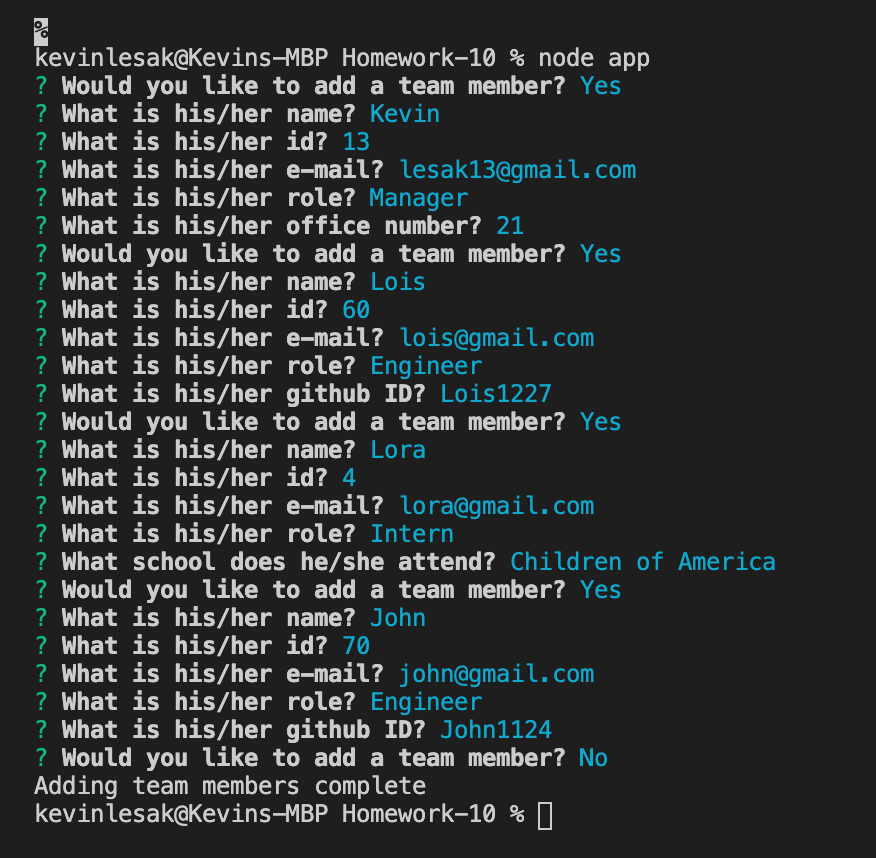
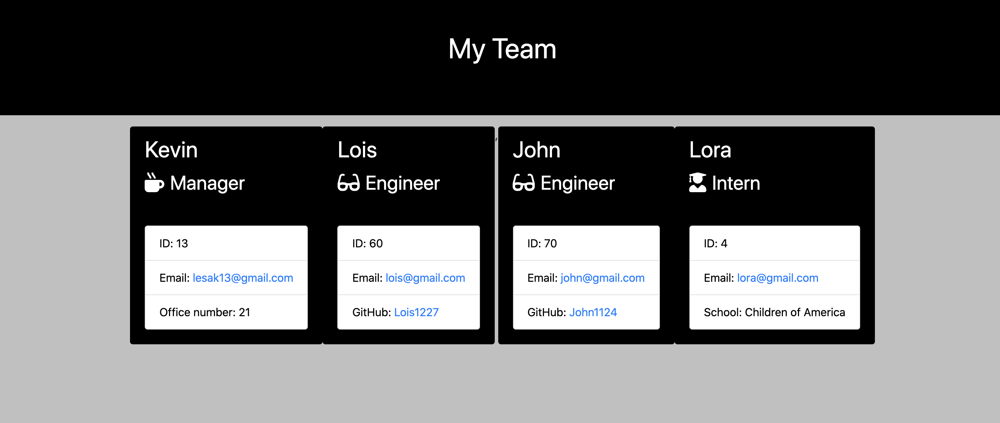

# Homework-10

For this homework assignment, much of the code was already provided.  With the four test files (Employee, Engineer, Intern and Manager) provided, I adjusted the four corresponding lib files.  In each file, I set up a class.  The employee file is the parent class, with each of the other three extending that class.  For each file, I exported the class to be used in other files.

To ensure that each of the classes was set up correctly, I ran "npm run test" and was provided with the test information.  The image below shows that each of the tests and the test suites passed.  I then proceeded to code in the app.js file.

In the app.js file, provided for us was the required modules.  After installing the modules for inquirer and file system, I created an array of questions.  After the initial four questions that ask the team members, name, id, email and role, I used the when method to ask an additional question each based on the answer given to the role question.  For example, when the user chooses to add a manager, the question asking their office number is prompted.

When the CLI is initiated, the user is provided with a simple confirm question from inquirer.  It asks the user if they would like to add a team member.  When the user chooses, yes, the questions begin.  After the questions are answered, again, the user is asked if they would like to add a member.  This process continues until the user selects No.

Part of the app.js file includes creating a new constructor.  For example, if the user chooses Manager, I used the operator 'new' to create a new Manager object.  That object is then pushed to an array with name 'employees'.

Below, is an image of the CLI after the user adds four team members.

When the user chooses No and is finished adding team members, the 'fs' module is used to write a file using the render function.  The htmlRenderer.js file provided creates a new file named 'team.html' in the output folder.  Below is the image of the team.html in chrome with the four members and their information provided in the CLI.  I added some simple CSS, as well.

